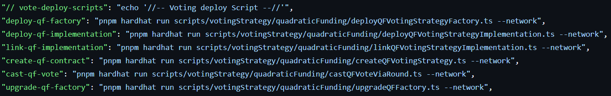

# Writing a Custom Voting Strategy

### Setting Up

1. Fork the [allo-protocol/contracts](https://github.com/allo-protocol/contracts) repo.
2. Follow the [dev steps](https://github.com/allo-protocol/contracts/blob/main/docs/DEV.md) to install pnpm and run the tests in your environment.
   1. When creating the .env file, you will need to fill in the following values:
      * `INFURA_ID` : Infura ID for deploying contract
      * `DEPLOYER_PRIVATE_KEY` : address which deploys the contract
      * `ETHERSCAN_API_KEY` : API key for etherscan verification
3. Create a new voting strategy solidity file in contracts/votingStrategy and have it inherit from IVotingStrategy.&#x20;


All voting strategy contracts must inherit from the IVotingStrategy interface


```
import "@allo/votingStrategy/IVotingStrategy.sol";

contract CustomVoting is IVotingStrategy {
```

### Writing the Contract

#### Adding the Vote Function

The IVotingStrategy provides a basic vote function: \
`function vote(bytes[] calldata _encodedVotes, address _voterAddress) external virtual payable;`

To implement it in your contract you will need to:

* add isRoundContract modifier
* decode votes
* add the vote logic
* emit a voted event

#### Emitting events

It is best practice to have your contract emit events when functions are called. Below is a sample voted event.

```
//// @notice Emitted when a new vote is sent
  event Voted(
    address token,                    // voting token
    uint256 amount,                   // voting amount
    address indexed voter,            // voter address
    address grantAddress,             // grant address
    bytes32 indexed projectId,        // project id
    uint256 applicationIndex,         // application index
    address indexed roundAddress      // round address
  );
```

### Deploying to a Chain

The Allo project has been configured to support the following chains:

* goerli
* optimism-mainnet
* fantom-mainnet
* fantom-testnet
* mainnet

One of these chains will need to be provided when running a deploy script.

#### Deployment Steps

1. Create a deploy script. The [scripts](https://github.com/allo-protocol/contracts/tree/main/scripts/votingStrategy/quadraticFunding) for the Quadratic Funding contract can be used as a template. Be sure to replace all mentions of QuadraticFunding with your contract name.
2.  Add the new script information to the [package.json](https://github.com/allo-protocol/contracts/blob/65ae960241b272aae2fbb8f5a8a8f8c057c23f0f/package.json) so it can easily be run using pnpm. The voting scripts can be found under "// vote-deploy-scripts"\


    <figure><figcaption></figcaption></figure>


3.  Follow the [Voting Strategy deploy steps](https://github.com/allo-protocol/contracts/blob/main/docs/DEPLOY\_STEPS.md#votingstrategy-setup) using the scripts you created and the chain you wish to deploy to.\
    ex:

    ```
    pnpm run deploy-newVoting-factory goerli
    ```

&#x20;

